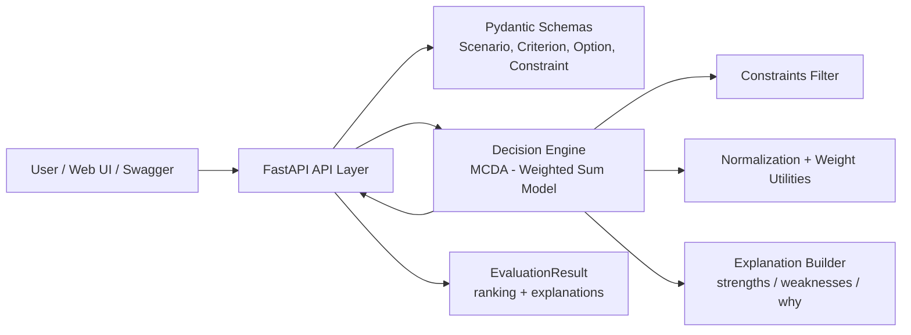
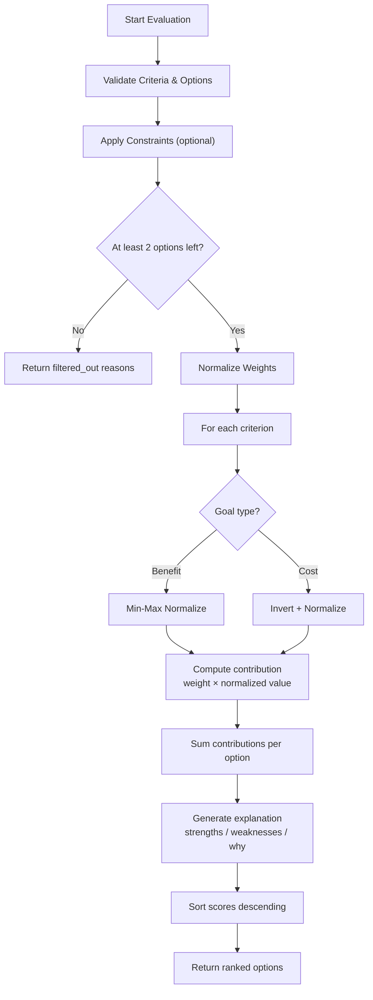
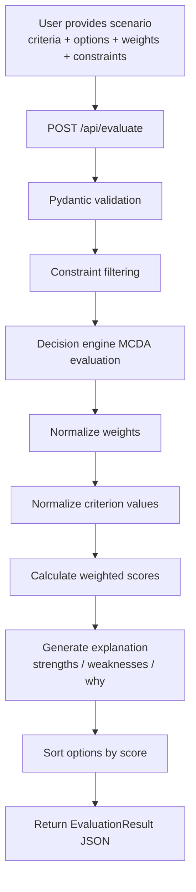

architectures:
 Architectural diagram:

```mermaid
flowchart LR
    USER["User / Web UI / Swagger"] --> API["FastAPI API Layer"]
    API --> SCHEMA["Pydantic Schemas<br/>Scenario, Criterion, Option, Constraint"]
    API --> ENGINE["Decision Engine<br/>MCDA - Weighted Sum Model"]
    ENGINE --> CONSTRAINTS["Constraints Filter"]
    ENGINE --> UTILS["Normalization + Weight Utilities"]
    ENGINE --> EXPLAIN["Explanation Builder<br/>strengths / weaknesses / why"]
    ENGINE --> API
    API --> RESPONSE["EvaluationResult<br/>ranking + explanations"]
```
decision logic flowchart:

```mermaid
flowchart TD
    START["Start Evaluation"] --> CHECK["Validate Criteria & Options"]
    CHECK --> FILTER["Apply Constraints (optional)"]

    FILTER --> REMAIN{"At least 2 options left?"}
    REMAIN -->|No| STOP["Return filtered_out reasons"]
    REMAIN -->|Yes| WEIGHT["Normalize Weights"]

    WEIGHT --> LOOP["For each criterion"]
    LOOP --> GOAL{"Goal type?"}
    GOAL -->|Benefit| NORM1["Min-Max Normalize"]
    GOAL -->|Cost| NORM2["Invert + Normalize"]

    NORM1 --> SCORE["Compute contribution<br/>weight × normalized value"]
    NORM2 --> SCORE

    SCORE --> TOTAL["Sum contributions per option"]
    TOTAL --> EXPLAIN["Generate explanation<br/>strengths / weaknesses / why"]
    EXPLAIN --> SORT["Sort scores descending"]
    SORT --> END["Return ranked options"]
```
data flow diagram:

```mermaid
flowchart TD
    A["User provides scenario<br/>criteria + options + weights + constraints"] --> B["POST /api/evaluate"]
    B --> C["Pydantic validation"]
    C --> D["Constraint filtering"]
    D --> E["Decision engine MCDA evaluation"]
    E --> F["Normalize weights"]
    F --> G["Normalize criterion values"]
    G --> H["Calculate weighted scores"]
    H --> I["Generate explanation<br/>strengths / weaknesses / why"]
    I --> J["Sort options by score"]
    J --> K["Return EvaluationResult JSON"]
```
